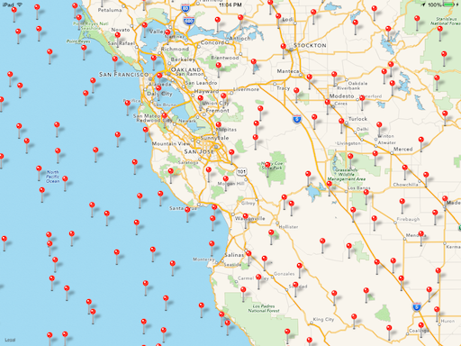

MapClustering
=============

Group nearby pins in MKMapView to enhance performance

The below example is made on 100,000 pin. The example works **great** on iPhone 5S and **not bad** on iPad 2

**zoomed out; only few pins appear**

**a little zoom in; some pins start to appear**

**a deep zoom in; reveal for even more pins**

Structure
=============

There are 3 classes used

1. EHMapView subclass of MKMapView ... your main concern
2. EHMapViewDelegate this is assigned as the delegate to the MKMapView ... you may need to modify this to support more delegate methods from MKMapViewDelegate protocol
3. EHClusteringOperation ... this is were clustering takes place

How to use
=============

Your only concern will be mainly on EHMapView. You will need to use the "EH" version of add/remove annotation in order to let the MapView Work properly

You will need to use these methods
* (void)addEHAnnotation:(id<MKAnnotation>)annotation;
* (void)addEHAnnotations:(NSArray *)annotations;
* (void)removeEHAnnotation:(id<MKAnnotation>)annotation;
* (void)removeEHAnnotations:(NSArray *)annotations;